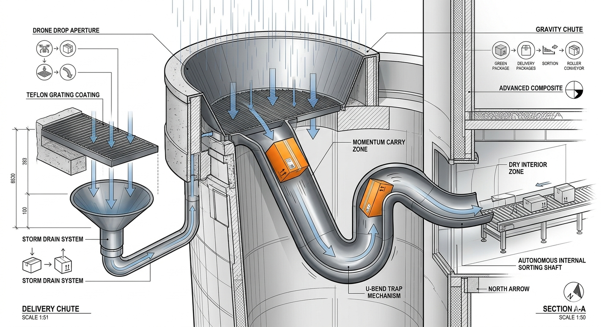
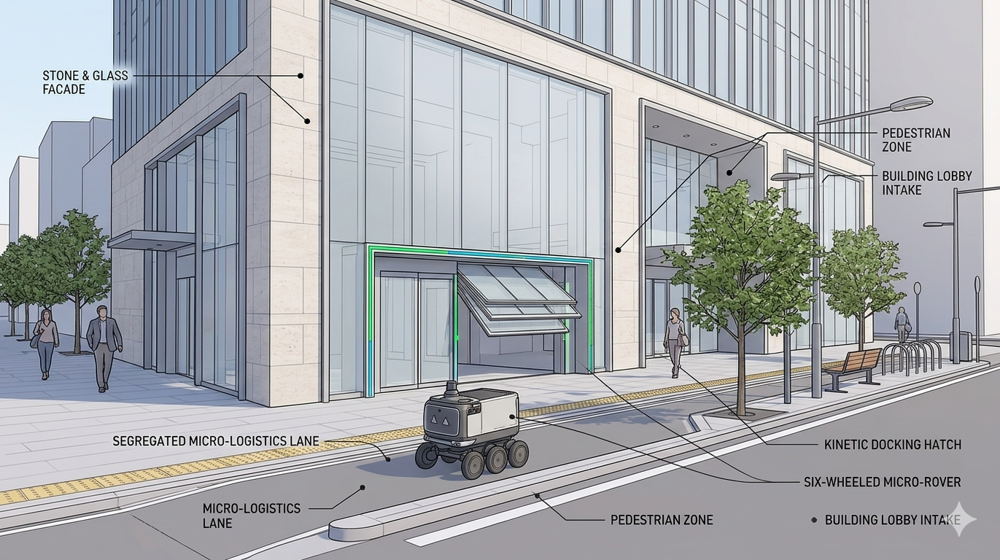
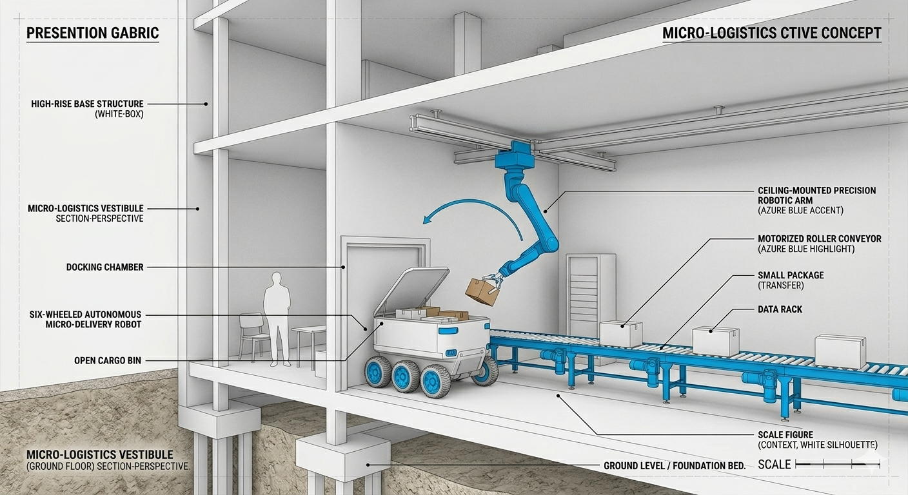
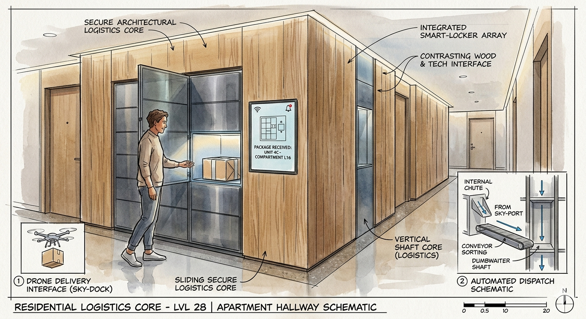
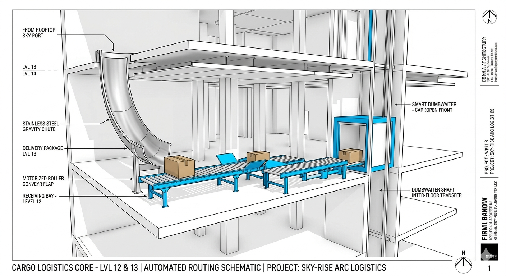
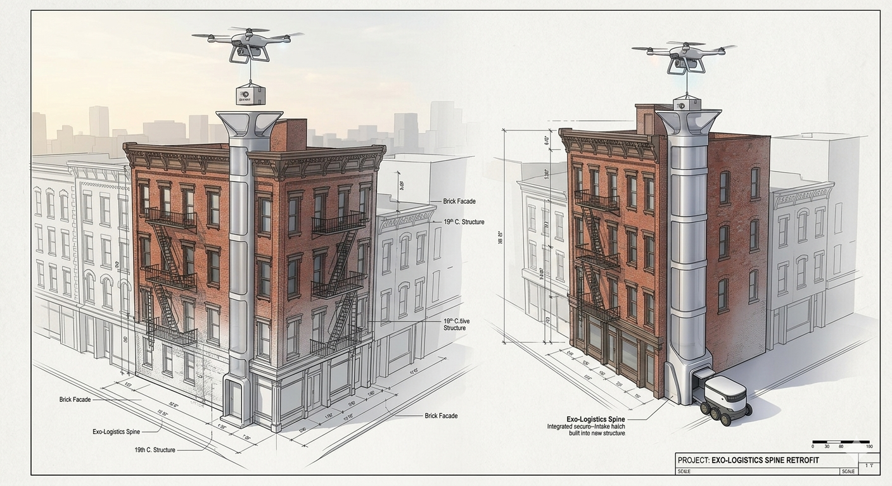
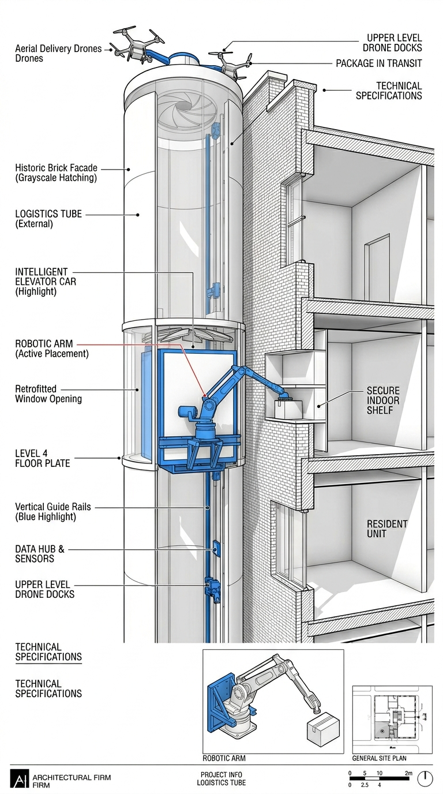
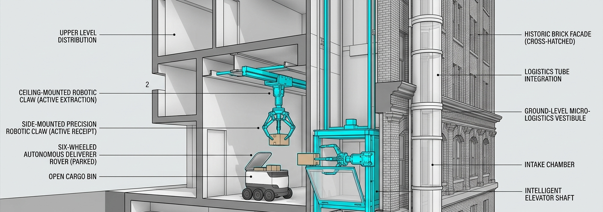

# Cargo-to-Door Design

A concept and system-design project for autonomous cargo delivery in high-rise environments.

This repository showcases two infrastructure models:
- **New Building Infrastructure** using a rooftop flight deck and internal delivery shaft
- **Historic Building Retrofit** using an external exo-logistics spine and controlled drop tube

## Project Overview

`Cargo-to-Door Design` explores how drones and micro-rovers can deliver parcels to residents without requiring direct drone landing at each unit.  
The design emphasizes passive logistics, mechanical reliability, and retrofit feasibility for existing urban buildings.

Primary documents:
- `report.pdf` - full technical and business report
- `presentation.pdf` - project presentation slides
- `report.tex` - LaTeX source of the report

## Key Concepts

- **Rooftop Flight Deck:** centralized aerial handoff point for incoming drones
- **Vertical Delivery Core:** gravity-assisted or mechanically guided internal package routing
- **Exo-Logistics Spine:** exterior retrofit tube for legacy buildings
- **Ground Rover Integration:** package handoff compatible with small sidewalk delivery rovers
- **Passive-First Engineering:** minimizing expensive active robotics in the main flow

## Visual Showcase

### New Building System








### Retrofit System





### Planning


## Repository Structure

```text
.
|-- content.md
|-- images/
|-- presentation.pdf
|-- report.pdf
|-- report.tex
`-- README.md
```

## License

This project is licensed under the **MIT License**.  
See `LICENSE` for full text.
