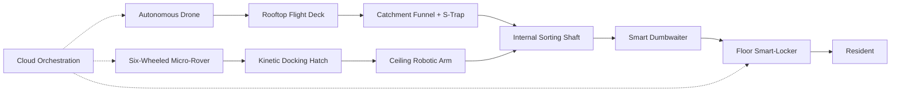
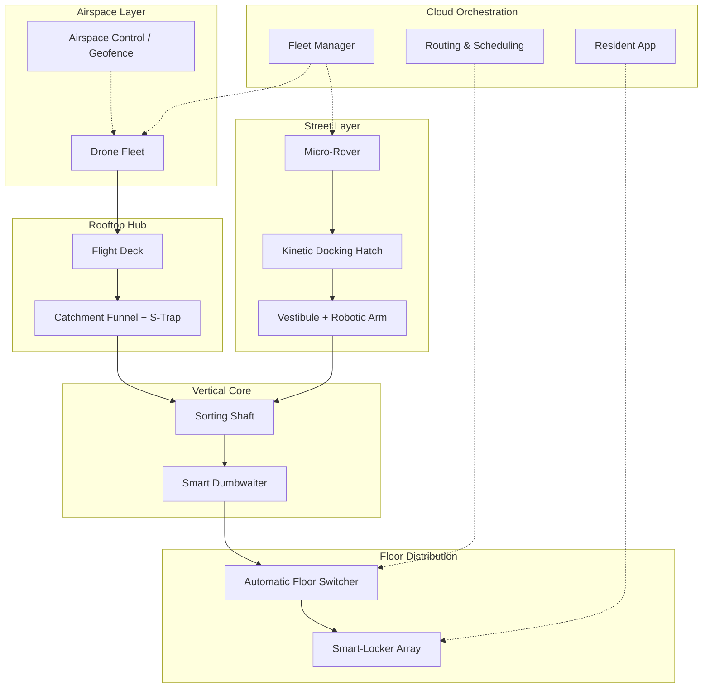
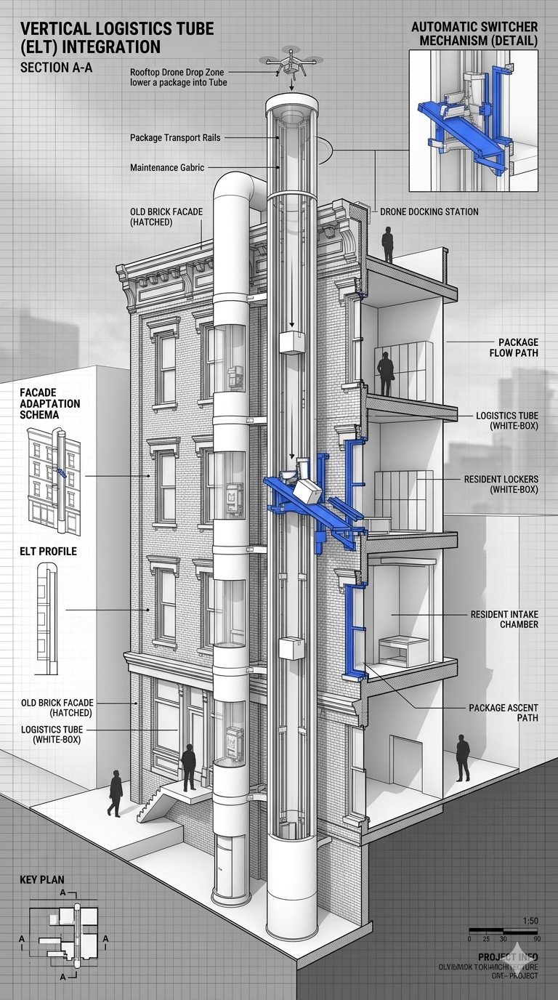
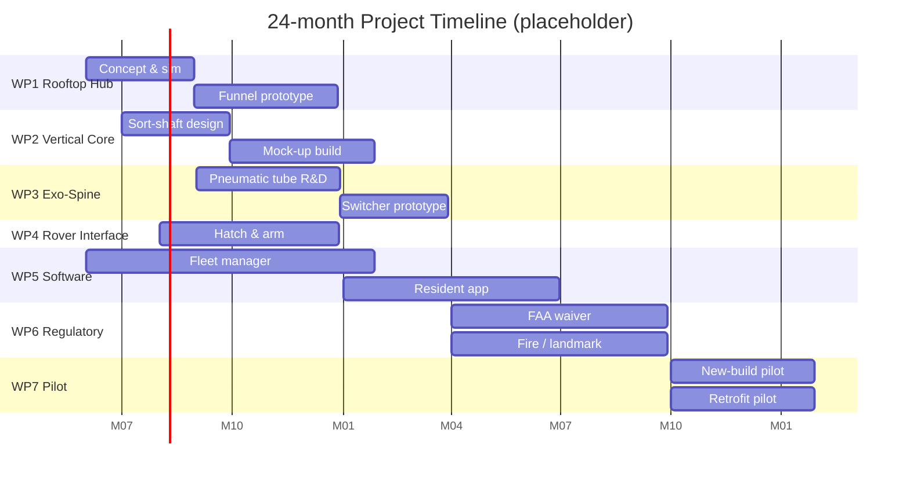

<!-- _class: title -->
<!-- _paginate: false -->

# Cargo-to-Door

### Autonomous Last-Meter Delivery for Vertical Cities

A building-integrated logistics platform for new high-rises **and** historic retrofits.

[placeholder] Presented by: Team Name — PI, Co-PI, Members — Institution — Date

---

## Agenda

1. **Background**
   - Motivation & Problem Definition
   - Literature Survey: state of the art, our proposed solution, breakthrough technologies

2. **The Team & Innovative Product Development**
   - Team & capabilities, requirements, architecture, design, implementation, testing

3. **Roadmap / Project Plan**
   - Milestones, deliverables, work packages, timeline

4. **Commercialization & Business Model**
   - Market, competition, budget, risks

---

<!-- _class: section-divider -->

# Part 1 — Background

---

## Motivation & Problem Definition

- **Last-mile is the broken link.** It accounts for ~30–50% of total e-commerce logistics cost and a disproportionate share of urban congestion and emissions.
- **The "last-meter" problem.** Even when a parcel reaches a building lobby, the journey from front-door to apartment-door is manual, slow, and unreliable.
- **Failed deliveries & porch piracy.** Missed handoffs and unattended parcels drive return-rates, theft, and customer churn.
- **Vertical density breaks current solutions.** Drones cannot land on every balcony; sidewalk rovers cannot ride elevators; couriers cannot scale to 50-storey towers.
- **Heritage constraints.** Protected and historic buildings cannot be torn open for new logistics infrastructure — yet their residents demand the same service level.

> Goal: a continuous, autonomous, weatherproof path from the sky (or sidewalk) to the resident's door — in both new construction and historic retrofits.

---

## Literature Survey — Past Solutions / State of the Art

| Approach | Examples | Strengths | Limitations |
|---|---|---|---|
| Drone-to-doorstep | Wing, Zipline, Matternet | Bypasses ground congestion | Needs landing pad; weather-sensitive; one parcel per flight; not vertical-city friendly |
| Sidewalk micro-rovers | Starship, Serve, Coco | Low-cost, social-friendly | Stuck at the lobby; no vertical access; theft risk |
| Parcel-locker arrays | Amazon Hub, InPost | Secure, asynchronous pickup | Still requires resident trip; ground-floor only |
| Pneumatic / vacuum tubes | Hospital legacy, Hyperloop-cargo concepts | Weather-immune, high throughput | Single-routing; expensive retrofit; small payload |
| In-building robotics | Relay, Savioke | Door-to-door inside building | Needs elevator integration; no exterior link |

**Gap:** no end-to-end system spans *airspace → building skin → vertical core → resident door*, and none retrofits gracefully onto protected architecture.

---

## Proposed Solution & Innovation

**Two parallel tracks, one platform:**

- **New builds — Rooftop *Flight Deck* + internal vertical shaft.**
  Drones *hover and winch-drop* into an open aerodynamic catchment funnel — no landing required.
- **Historic builds — *Exo-Logistics Spine*.**
  A modular, exterior pneumatic-decelerator tube clipped to the facade, feeding automatic floor-switchers inside.
- **Passive-logistics philosophy.** Gravity chutes, motorized rollers, mechanical diverters and claws replace expensive robotic arms wherever possible.
- **Multi-modal intake.** The same vertical core accepts both *aerial drone* and *sidewalk micro-rover* deliveries.

---

## Breakthrough Technologies Required

- **Hover-and-winch package drop** — drone holds altitude `Z` while lowering a parcel; controller compensates for wind and tether sway.
- **Aerodynamic catchment funnel + S-Trap drainage** — captures off-center drops, lets rain through, blocks rain from following the parcel.
- **Pneumatic decelerator tube** — variable-pressure exterior shaft that slows a free-falling parcel from terminal velocity to safe handoff speed.
- **Automatic floor-switcher** — passive-actuated diverter that routes packages into the correct resident's intake chamber.
- **Micro-rover ↔ kinetic docking hatch** — standardized mechanical/data interface so any six-wheeled rover can offload into the building.
- **Building-level airspace orchestration** — scheduling, geofencing, and conflict-resolution for multiple drones over a single rooftop.

---

<!-- _class: section-divider -->

# Part 2 — Team & Innovative Product

---

## The Team & Capabilities

[placeholder] — fill with real names, affiliations, and CVs before submission.

| Role | Person | Capability brought |
|---|---|---|
| Principal Investigator | [name] | Systems engineering, autonomous vehicles |
| Mechanical Lead | [name] | Aerodynamic structures, pneumatic systems |
| Controls & Robotics | [name] | Drone control, robotic manipulation |
| Software & Cloud | [name] | Fleet orchestration, edge computing |
| Architecture & Civil | [name] | High-rise integration, historic-preservation retrofits |
| Business & Regulatory | [name] | Go-to-market, FAA / municipal liaison |

**Institutional capabilities:** wind-tunnel access, drop-test rig, full-scale mockup hall, partnership LOIs with [developer] and [historic-district BID].

---

## Innovative Product / Process Development — Overview

Two intake modalities (sky + street) converge on a single internal sorting core that distributes to resident smart-lockers — orchestrated by the cloud layer.

---

## Requirements Definition & Analysis

**Functional**

- Throughput: [≥ 60 pkg/hr per building peak]
- Payload envelope: [≤ 5 kg, ≤ 40 × 30 × 30 cm]
- End-to-end latency drone-arrival → locker: [< 4 min]

**Non-functional**

- Weatherproof to [IP65 equivalent]; operable in [wind ≤ 12 m/s, rain ≤ 25 mm/h]
- Acoustic limit at facade: [≤ 55 dBA at 10 m]
- Fire-rating of internal shafts: [≥ 2-hour]

**Regulatory / safety**

- FAA Part 107 (or local equivalent) drone operations
- Local building, fire, and (for retrofits) landmark-commission codes

**UX**

- Resident retrieval time at locker: [< 30 s]; mobile app notify within [10 s of locker close]

---

## High-Level System Architecture

---

## Design — Rooftop Flight Deck

- **Stable delivery zone** with perforated wind-break louvers to tame rooftop turbulence.
- **Aerodynamic catchment funnel** sized for off-center hover drops.
- **Secure storage lockers** for high-value or oversized parcels awaiting retrieval.
- **Hover-winch protocol**: drone holds altitude `Z`, lowers parcel through funnel mouth, releases tether — never lands.
- **Flight-path corridor** geofenced into building airspace; multiple drones serialized on approach.

---

## Design — Drop Funnel & S-Trap Drainage

- **Drone drop aperture** with **Teflon-grated** inner skin — parcel slides, water passes through.
- **U-bend / S-Trap mechanism** — passive drainage; rainwater diverts to the storm drain, parcel continues down the *Momentum Carry Zone*.
- **Dry interior zone** opens onto the **autonomous internal sorting shaft** and roller conveyor.
- Solves the rain-in-shaft constraint called out in `content.md` — *no* powered seals, *no* moving water doors.

---

## Design — Internal Sorting Core

- **Stainless-steel gravity chute** delivers parcels from the rooftop core to floor-level receiving bays.
- **Motorized roller conveyor + diverter flaps** route each parcel to its destination column.
- **Smart dumbwaiter** (open-front car in a dedicated shaft) lifts/lowers to the resident's floor.
- Embodies the **passive-logistics** principle from `content.md`: gravity + rollers + mechanical diverters in place of robotic arms.

---

## Design — Resident Smart-Locker Array

- **Integrated smart-locker array** built into the apartment-floor hallway wall — wood facade, glass + tech inserts.
- **Sliding secure logistics core** behind the lockers connects directly to the vertical shaft.
- Resident receives push notification (*"Package received: Unit 4C, Compartment L16"*), authenticates at the screen, locker opens.
- Inset schematic on the source drawing details the automated dispatch path: internal chute → conveyor sorting → dumbwaiter shaft.

---

## Design — Retrofit "Exo-Logistics Spine"

- **Exterior modular tube** clamped to the facade of historic buildings — no structural intervention to the protected envelope.
- **Pneumatic decelerator** inside the tube progressively brakes a free-falling parcel.
- **Automatic switcher mechanism** (right inset) diverts the parcel into each floor's **resident intake chamber**.
- Rooftop **drone docking station** caps the spine; a drone lowers the parcel into the tube mouth.
- Honors the heritage facade while delivering modern logistics capability.

---

## Design — Ground-Level Micro-Rover Interface

- **Segregated micro-logistics lane** along the sidewalk; rover approaches the **kinetic docking hatch** in the facade.
- Inside the vestibule, a **ceiling-mounted precision robotic arm** lifts parcels off the rover's open cargo bin onto a **motorized roller conveyor** that joins the internal sorting shaft.
- Retrofit equivalent: **street-level micro-vestibule** with a telescoping claw + motorized lift-tray (see `images/retrofit-claw.png`).
- Implements the *sidewalk-rover pivot* called out in `content.md`.

---

## Implementation & Testing

**Prototyping plan**

1. **Subscale rooftop funnel** + instrumented drop rig — characterize capture cone vs. wind speed.
2. **Single-floor mockup** of internal sorting + smart-locker — measure throughput and jam rate.
3. **Exo-Spine pilot section** (3 storeys) on a non-occupied historic structure — validate pneumatic deceleration and switcher routing.
4. **Rover ↔ hatch integration** with a partner micro-rover OEM.

**Test KPIs** [placeholder targets]

| KPI | Target |
|---|---|
| Drop capture success rate | ≥ 99.5% |
| Mean time, rooftop → locker | ≤ 3 min |
| Facade acoustic level | ≤ 55 dBA @ 10 m |
| Rain ingress past S-Trap | 0 ml/h @ 25 mm/h rainfall |
| Rover handoff cycle time | ≤ 45 s |

---

<!-- _class: section-divider -->

# Part 3 — Roadmap / Project Plan

---

## Roadmap / Project Plan

[placeholder] — 24-month phased plan, refine with real funding milestones.

| Phase | Months | Focus | Exit gate |
|---|---|---|---|
| **P1 — R&D** | 1–4 | Concept refinement, simulation, safety case | Design review #1 |
| **P2 — Subsystem prototypes** | 5–10 | Funnel, S-Trap, switcher, hatch, rover dock | Bench-test sign-off |
| **P3 — Integrated single-floor pilot** | 11–16 | New-build mockup + Exo-Spine 3-storey rig | End-to-end KPI demo |
| **P4 — Certification & approvals** | 17–20 | FAA waiver, fire & building code, landmark commission | Permits granted |
| **P5 — Commercial pilot** | 21–24 | One new-build tower + one retrofit block | Paying first customer |

---

## Milestones, Deliverables & Work Packages

[placeholder] — owners and exact months TBD.

| WP | Title | Key deliverables | Lead | Month |
|---|---|---|---|---|
| WP1 | Rooftop Hub | Flight Deck mock-up, hover-drop protocol spec | [name] | M8 |
| WP2 | Vertical Core | Sorting-shaft prototype, dumbwaiter integration | [name] | M12 |
| WP3 | Exo-Spine | Pneumatic-tube section, automatic switcher | [name] | M14 |
| WP4 | Rover Interface | Kinetic docking hatch + robotic-arm vestibule | [name] | M12 |
| WP5 | Software & Orchestration | Fleet manager, resident app, routing engine | [name] | M16 |
| WP6 | Regulatory & Safety | FAA waiver, fire/building/landmark approvals | [name] | M20 |
| WP7 | Pilot Deployment | One new-build + one retrofit operating | [name] | M24 |

---

## Task Allocation & Timeline

---

<!-- _class: section-divider -->

# Part 4 — Commercialization & Business Model

---

## Market Analysis

**Target market**

- Luxury high-rise residential developers (new construction)
- Smart-city districts and master-planned communities
- Historic-district Business Improvement Districts (BIDs) commissioning the Exo-Spine retrofit
- Mixed-use towers with concierge service expectations

**Customer profile**

- Developer / building owner buys the infrastructure; residents are the end users.
- Logistics providers (Amazon, FedEx, UPS, local couriers) are channel partners paying per-delivery.

**Bureaucracy & approvals**

- FAA Part 107 + local airspace authority
- Building & fire code (UL listing for shafts)
- Landmark / historic-preservation commissions (retrofit only)

**Market size** [placeholder]

- TAM: $XX B global vertical-living logistics
- SAM: $X B Tier-1 cities with drone-friendly regs
- SOM (Year 5): $XXX M

**Marketing & growth strategy**

- Lighthouse pilot with one flagship developer → case study → master-developer agreements.
- "Logistics-ready building" certification co-marketed with developers.
- API partnerships with major carriers for instant scale on Day 1 of a building going live.

---

## Competitor Analysis

| Competitor | Their play | Where we win |
|---|---|---|
| **Wing / Zipline / Matternet** | Drone-to-doorstep delivery | We solve the *last-meter* (lobby→door); they stop at the curb / yard |
| **Starship / Serve / Coco** | Sidewalk micro-rovers | We *integrate* with their rovers via a standard hatch — we are the building-side complement, not a competitor |
| **Amazon Hub / InPost** | Ground-floor parcel lockers | Our smart-lockers are *on the resident's own floor*, fed automatically — no lobby trip |
| **Relay / Savioke** | In-building delivery robots | We bypass elevators with a dedicated shaft; lower opex, higher throughput |
| **Pneumatic-tube vendors** | Hospital-grade tubes | We add aerial intake, weather handling, and resident-locker layer |

**Our competitive advantage**

- **Only end-to-end, building-integrated** stack from airspace to apartment door.
- **Weatherproof passive shafts** — no powered seals to fail.
- **Retrofit option** (Exo-Spine) unlocks the entire historic-building market that no competitor addresses.
- **Modality-agnostic** — same core serves drones, rovers, and human couriers.

---

## Budget, Pricing & Monetization

**Cost structure** [placeholder]

| Line | Year 1 | Year 3 |
|---|---|---|
| R&D / engineering | $X M | $X M |
| Hardware (per-building install) | $XXX k | $XXX k |
| Software / cloud | $X M | $X M |
| Operations & support | $X M | $X M |

**Pricing models**

- **Capex sale** of the in-building infrastructure to developers (new construction) or BIDs (retrofit).
- **SaaS** orchestration fee per building per month — $X k/mo.
- **Per-delivery fee** charged to logistics partners — $X.XX per parcel.
- **Premium-resident subscription** for guaranteed time-slots and oversized-parcel handling.

**Unit economics** [placeholder]

- Payback per building: ~XX months
- Gross margin at scale: ~XX%

---

## Challenges & Business Risks

| Risk | Likelihood | Impact | Mitigation |
|---|---|---|---|
| Urban drone-airspace regulation slips | High | High | Early FAA waiver process; partner with city pilot programs |
| Public acceptance (noise, privacy, "drones overhead") | Med | High | Acoustic engineering at facade; opt-in resident comms; community design reviews |
| Insurance & liability for sky-dropped parcels | Med | Med | Capped payload, redundant tether, geofenced corridor, partner with logistics-insurance underwriter |
| Landmark-commission rejection of Exo-Spine | Med | High | Reversible / non-penetrating clamps; engage preservation architects from day 1 |
| Weather window too narrow (wind, ice, lightning) | Med | Med | Hybrid sky + street modality — rovers cover the window where drones can't fly |
| Hardware reliability (jammed switcher, frozen rollers) | Med | Med | Passive-mechanical design philosophy; predictive maintenance via cloud telemetry |
| Capital intensity / long sales cycle to developers | High | Med | SaaS layer for recurring revenue; lighthouse-pilot case-study to compress sales cycle |

---

<!-- _class: title -->
<!-- _paginate: false -->

# Thank You

### Questions & Discussion

[placeholder] contact: team@cargo-to-door.example | project repo: github.com/&lt;org&gt;/cargo-to-door-design
